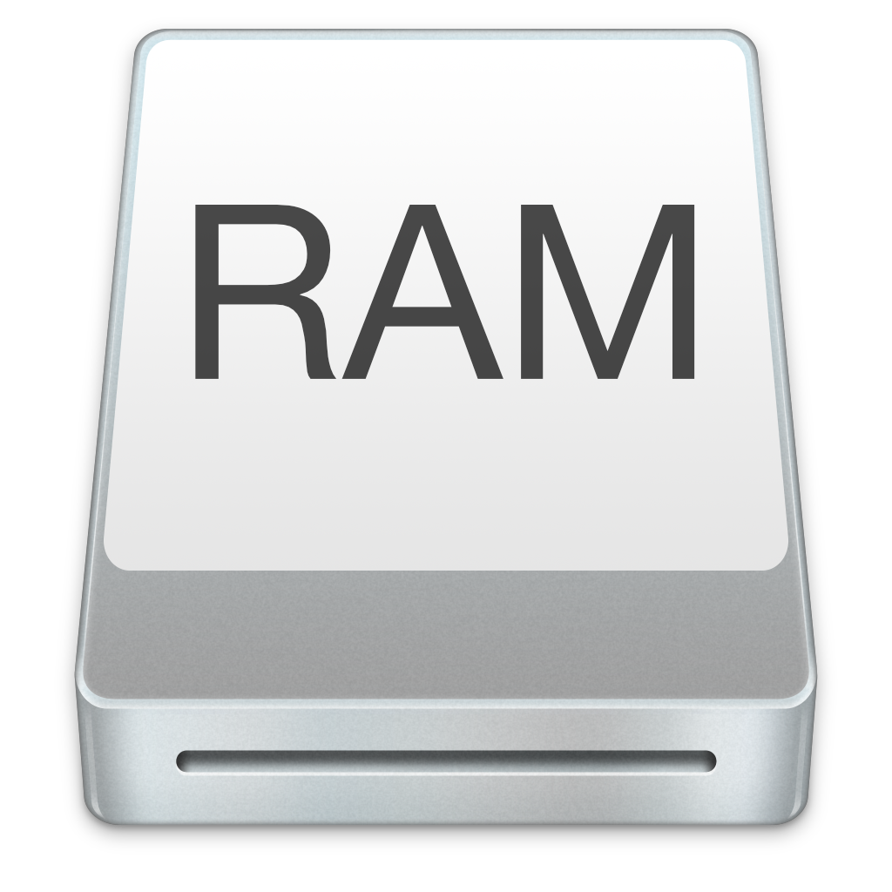

# Open RAM Disk

This little shell script creates a RAM Disk and opens a Finder window. If there is already a Volume named "RAM Disk" the script just tells macOS to open it. Nothing more nothing less.

The RAM Disk is roughly 524MB big (512 * 2048 because of block sizes).

Sources:

* https://www.techjunkie.com/how-to-create-a-4gbs-ram-disk-in-mac-os-x/
* https://www.deviantart.com/jasonzigrino/art/OS-X-Yosemite-Drives-476685369
* https://mathiasbynens.be/notes/shell-script-mac-apps